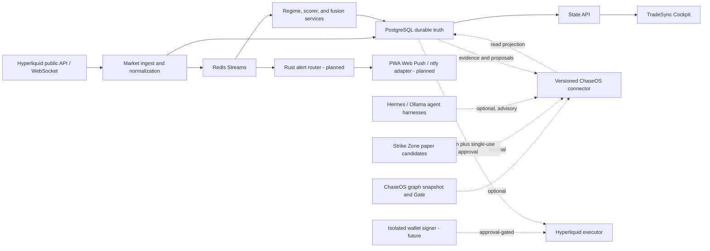

# TradeSync

<p align="center">
  
</p>

TradeSync is a standalone-first Hyperliquid market intelligence, paper-trading, alerting, evidence, and future governed-execution workstation.

It becomes more capable when connected to ChaseOS, Strike Zone Crypto, local AI runtimes, or an isolated wallet, but none of those systems is required for its core market, regime, alert, chart, paper-review, and journal functions.

## Product contract

TradeSync has three explicit capability tiers:

| Tier | Name | Works when | Capability |
|---|---|---|---|
| A | Standalone workstation | Hyperliquid public data, PostgreSQL, Redis, State API, and Cockpit are available | Market state, regimes, charting, alerts, paper opportunities, evidence, journal, and historical review |
| B | Federated intelligence | Optional connectors are healthy | ChaseOS knowledge, Strike Zone candidates, local model explanations, and richer cross-project context |
| C | Governed execution | Wallet signer, risk policy, approval ledger, and reconciliation all pass | Preview, approval-required paper/live actions, and later bounded autonomous actions |

Tier A must continue when any Tier B connector is unavailable. Tier C always fails closed when ChaseOS approval authority, signer state, risk state, or reconciliation is unavailable.

## Current truth — 2026-09-02

- Hyperliquid is the only venue and authoritative market source.
- The local operator runtime is paper-only: `EXECUTION_ENABLED=false`, `DRY_RUN=true`.
- No wallet, private key, signer, live order authority, or mobile push deployment is configured.
- PostgreSQL 16 and Redis 7 are active dependencies; Qdrant is an optional evidence profile.
- CoinGecko and DefiLlama are free, context-only feeds. FRED is an optional free-key macro feed.
- The responsive Mission Control dashboard and read-only execution readiness surface are implemented locally.
- The canonical ChaseOS private instance is `C:\Users\chaseos\Documents\chaseos_chaseintech`. Its live knowledge connector is not currently available, so the interface in this repository is a proposed versioned contract, not a verified live integration.
- The first Rust component is a shared contract crate. The Rust alert router and Hyperliquid real-time edge are roadmap work, not complete services.
- Quant Foundations Book 1 and a versioned paper-only regime-weight engine are implemented locally. They do not yet replace the legacy live dashboard classifier or scorer.
- A source-governed 17-feature catalog, cadence-governed market extractor, ordinary/robust normalizer, backend block aggregation, and private Regime Lab are implemented locally.
- The Docker-backed runtime has been verified with live Hyperliquid public data, seven-day Redis feature history, transactional migration application, PostgreSQL draft-experiment persistence, and Cockpit-to-State-API proxy recovery after a State API replacement. Fixed-window replay and active-scorer replacement remain planned.
- The read-only Integration Pipeline inspector is implemented at `/pipeline`. It combines live runtime probes with declared connector contracts, lists missing links and bounded recovery targets, and keeps Tier B connector health outside the Tier A readiness count.
- The current bounded profile does not start ingest-gateway, core-scorer, fusion-engine, an agent harness, Strike Zone, ChaseOS, or execution. The inspector reports those gaps instead of presenting repository code as a live integration.
- Hyperliquid 24-hour change remains deliberately blank and non-blocking in this slice. Direct liquidation flow remains unavailable and is not replaced with an OI proxy.

## Architecture at a glance



The detailed architecture lives in [docs/architecture/STANDALONE_FEDERATED_ARCHITECTURE.md](docs/architecture/STANDALONE_FEDERATED_ARCHITECTURE.md).

## Data and knowledge choices

| Technology | Authority | Purpose |
|---|---|---|
| PostgreSQL 16 | Durable TradeSync source of truth | Market history, signals, opportunities, decisions, approvals, orders, outcomes, notification ledger, and a queryable projection of ChaseOS graph snapshots |
| Redis 7 Streams | Transport, never canonical truth | Low-latency fan-out, consumer groups, backpressure, latest-state caches, and reconnect recovery |
| Qdrant | Rebuildable derived index | Semantic retrieval over approved evidence and knowledge; never approval or execution authority |
| Content-addressed files on E: | Raw evidence and immutable artifacts | Source documents, graph snapshots, receipts, exports, and large attachments |
| ChaseOS `GraphSnapshot` | Canonical knowledge artifact | Stable nodes, edges, confidence, provenance, and snapshot identity; database indexes are adapters derived from it |

No dedicated graph database is required for the first implementation. PostgreSQL adjacency tables and recursive queries are enough for the initial knowledge projection; a dedicated graph engine is considered only after measured query benchmarks justify it. TimescaleDB also remains an evaluated migration, not a current capability—the repository’s `TimescaleStore` is still a placeholder.

## Start the bounded dashboard

Use the governed runtime environment already stored on E:. Do not copy credentials into this repository.

```powershell
docker compose `
  --env-file E:\Projects\TradeSync\dashboard-runtime\runtime.env `
  -f ops\compose.full.yml `
  -f ops\compose.market-command.yml `
  up -d postgres redis schema-init market-data state-api cockpit-ui
```

Open [http://localhost:3000/](http://localhost:3000/) or go directly to
[Regime Lab](http://localhost:3000/regime-lab) or the
[Integration Pipeline inspector](http://localhost:3000/pipeline).

On 2026-09-02 the bounded stack reported live public Hyperliquid observations
for 10 of the 17 catalog definitions. A non-scoring display value, a feature
collecting history, a zero-dispersion feature, and an unavailable source are
different states; the Regime Lab labels them separately. Counts and scores are
expected to change as the rolling windows advance.

Stop only the bounded services started above:

```powershell
docker compose `
  --env-file E:\Projects\TradeSync\dashboard-runtime\runtime.env `
  -f ops\compose.full.yml `
  -f ops\compose.market-command.yml `
  stop cockpit-ui state-api market-data redis postgres
```

Do not use `down -v`; that removes persistent volumes.

## Current dashboard surfaces

- `/` — Mission Control: authoritative market pulse, readiness, context feeds, system output, and safety state.
- `/market` — detailed market snapshots; the future Market Canvas drilldown starts here.
- `/regime-lab` — private paper-shadow feature evidence, challenger controls, learning gates, comparison, and draft experiment history.
- `/pipeline` — live Tier A/federated topology, missing-link evidence, workflow edges, capability gaps, and recovery targets. The top-bar status is focus/hover inspectable from every route.
- `/opportunities` — paper opportunity review.
- `/sources` — temporary legacy surface; roadmap replacement is Knowledge Graph intake and provenance.
- `/logs` — current decisions/orders evidence; roadmap replacement is Activity & Evidence with Decisions, Approvals, Orders, Alerts, and Outcomes.
- `/execution` — read-only readiness and activation gates; it contains no wallet secrets or arming controls.
- `/settings` — currently includes legacy browser-local connection fields and requires the operator-settings redesign described in the roadmap.

## Verification commands

Frontend:

```powershell
Set-Location services\cockpit-ui
npm run build
```

Python context feeds:

```powershell
python -m pytest services\state-api\tests\test_context_feed.py -q
```

Rust contracts:

```powershell
$tradeSyncRoot=(Resolve-Path '.').Path
$env:CARGO_HOME=(Join-Path $tradeSyncRoot '.cache\cargo')
$env:CARGO_TARGET_DIR=(Join-Path $tradeSyncRoot '.cache\cargo-target')
cargo test --workspace
```

## Documentation

- [Documentation index](docs/README.md)
- [Roadmap](roadmap.md)
- [Quant Foundations — Book 1](docs/quant-learning/README.md)
- [Regime Rulebook v1 architecture](docs/architecture/REGIME_RULEBOOK_V1.md)
- [Market feature v1 contract](docs/contracts/MARKET_FEATURE_V1.md)
- [Integration Pipeline status v1](docs/contracts/INTEGRATION_PIPELINE_STATUS_V1.md)
- [Standalone and federated architecture](docs/architecture/STANDALONE_FEDERATED_ARCHITECTURE.md)
- [Data and knowledge plane](docs/architecture/DATA_AND_KNOWLEDGE_PLANE.md)
- [Mobile alert control plane](docs/architecture/MOBILE_ALERT_CONTROL_PLANE.md)
- [Rust boundaries](docs/architecture/RUST_BOUNDARIES.md)
- [Provider matrix](docs/providers/MARKET_PROVIDER_MATRIX.md)
- [Historical Market Command handover](docs/CHASEOS_MARKET_COMMAND_HANDOVER.md)

Historical documents and diagrams can describe removed venues or aspirational components. Current source, tests, this README, `roadmap.md`, the Hyperliquid-only migration record, and ChaseOS governance take precedence.
