TradeSync — System Design (v0.1, Audited)

Goal: a reliable, explainable, low-latency system that ingests vetted sources, produces a live Bias + Opportunity Queue, and (optionally) executes through strict Risk Guardian rules.

1) High-Level Architecture

Pattern: event-driven microservices with a thin API layer.
Runtime: Python (agents/fusion/copilot, FastAPI), Node/TS (Hyperliquid exec svc).
Transport: Redis Streams (low-latency pub/sub + backpressure).
Persistence: Postgres/TimescaleDB (events, signals, decisions, journal).
Vector store (RAG): Qdrant (transcripts/ideas embeddings for copilot evidence).
Files: S3-compatible blob (audio, raw transcripts, attachments).

1.1 Services

ingest-gateway (FastAPI)
Endpoints for TradingView/Discord webhooks, Gmail/RSS pulls, YouTube job triggers, Metrics pulls.

yt-transcriber
yt-dlp → Whisper → chunked transcripts → pushes event records.

nlp-summarizer
Normalizes transcripts/ideas to Event objects (symbols, tf, stance, levels).

metrics-poller
Single provider (funding, OI, liqs, CVD) → thresholded Events.

agent-runner
Domain agents (tech/structure, funding/OI, sentiment, rotation/macro) consume Events and emit Signals.

fusion-engine
Maintains Bias state and Opportunity Queue per symbol×TF; stores component weights & Evidence links.

risk-guardian
Policy checks: daily loss stop, per-symbol exposure, leverage ceiling, cooldowns, do-not-trade.

exec-drift-svc (Python, driftpy)
Order preview/place/modify/cancel + account/positions stream.

exec-hl-svc (Node/TS)
Hyperliquid SDK (REST+WS POST). Dedicated process for latency & rate-limit control.

state-api (FastAPI)
Read endpoints for UI/copilot: bias, opportunities, evidence, positions, audit log.

copilot-api (FastAPI + LLM)
Session/position-aware answers; forces Evidence Trail citations.

discord-bot
Posts alerts & daily brief; limited command surface (preview, status, kill-switch).

etl-journal
Writes trade plans, decisions, and outcomes to Postgres; updates source Elo weights.

2) Data & Streams
2.1 Redis Streams (topics)

x:events.raw — raw inbound (TV alerts, RSS/Gmail items, metrics thresholds).

x:events.norm — normalized Event objects.

x:signals.* — per-agent output (e.g., x:signals.tech, x:signals.funding).

x:bias.state — current Bias snapshots per symbol×TF.

x:opps.rank — ranked Opportunities with Plan skeletons.

x:decisions — {plan_id, action: preview/execute/blocked, reason}.

x:exec.orders — order intents and results (per exchange).

x:journal — finalized records for DB.

2.2 Postgres Schema (conceptual)

events(id, ts, source, symbols text[], tf text[], stance text, text_raw, tags text[])

signals(id, ts, agent, symbol, tf, kind, value jsonb, confidence float, event_ids uuid[])

bias(id, ts, symbol, tf, score float, components jsonb)

opportunities(id, ts, symbol, tf, score float, rationale jsonb, evidence_ids uuid[], plan jsonb)

decisions(id, ts, plan_id, action text, reason text, policy jsonb)

orders(id, ts, venue text, side text, qty numeric, price numeric, status text, txid text)

journal(id, ts, plan_id, pre_state jsonb, post_state jsonb, pnl numeric)

sources(id, kind, handle, elo float, last_seen ts, vetted bool)

policies(id, cfg jsonb) (risk caps, DNT list, leverage ceilings, cooldowns)

2.3 Vector Store

Qdrant collections:

yt_chunks (embedding + metadata: creator, symbols, tf, timestamps)

tv_ideas (embedding + author, symbols, stances)

3) Domain Agents (inside agent-runner)

All agents implement a common conceptual interface:

input: Event (or scheduled tick with market snapshot)

output: Signal {agent_id, symbol, tf, kind, value, confidence, event_ids[]}

quality: calibrated confidence ∈ [0,1]; attach provenance (event_ids)

Agents in v0.1:

Tech/Structure Agent — consumes TV/Discord keepers: Unikill V1 (15m/1h), EMA 21×55 (15/30/1h), BTC Daily VWAP close, ETHBTC rotation, SOLETH spikes, Combo-FVG.

Funding/OI Agent — consumes metrics thresholds; detects squeeze risk and “fuel” for trends.

Sentiment/Narrative Agent — consumes YT + TV Ideas; weights by creator Elo × recency.

Rotation/Macro Agent — reasons across ETHBTC, SOLETH, DXY/SPX drift (basic rules in v0.1).

4) Fusion Engine (Bias & Opportunities)

Bias(symbol, tf)
score = 0.4*Tech + 0.3*Sentiment + 0.2*RegimeFit + 0.1*Macro
Stores component weights and links back to Signal.id.

Opportunity Queue
For each symbol×TF, candidates are scored:
Opp = Bias * Confluence * (1/VolRisk) * LiquidityEdge * TimingWindow
Produces top N with Plan skeletons (entry/SL/TP guard bands).

RegimeFit is computed from rolling kit performance (e.g., VWAP Pullback vs Trend Follow) and vol regime.

5) Risk Guardian (policy gate)

Inputs: Plan, current account/positions, policies.
Checks: daily loss stop, per-symbol exposure cap, leverage ceiling, cooldown timers, DNT list, min-quality (e.g., Evidence >= 3 refs when available).
Outputs: allow/blocked + reason + suggested adjustment (reduce size X%, wait for condition Y).

6) Execution Adapters

exec-drift-svc (Python + driftpy): creates orders, OCO (SL/TP), reads positions, emits status → x:exec.orders.

exec-hl-svc (Node/TS): uses Hyperliquid SDK with WS-POST; handles nonce/retry/backoff and asset map refresh.

Both services are isolated from the LLM/copilot; all keys in encrypted vault; per-venue kill-switch.

7) External Interfaces (selected endpoints)
7.1 Ingest-Gateway (FastAPI)

POST /ingest/tv – TradingView/Discord webhook (keepers only).

POST /ingest/rss – TV Ideas or newsletters (pre-filtered).

POST /ingest/metrics – provider webhooks or poll pushes (threshold hits).

POST /ingest/yt/callback – transcript ready.

7.2 State-API (FastAPI) [Port 8000]

GET /state/snapshot

GET /state/opportunities?symbol=BTC-PERP

GET /state/evidence?opportunity_id=...

GET /state/positions

POST /actions/preview {opportunity_id, size_usd, venue}

POST /actions/execute {decision_id, confirm}

7.3 Copilot-API

POST /copilot/chat {prompt, context:{symbol, tf, position_id?}}
Always returns cited evidence (evidence_ids).

8) Sequences (PlantUML)

You can paste these into your PlantUML setup (VS Code + Graphviz) to render.

8.1 Ingest → Bias Update
@startuml
actor TradingView
participant "ingest-gateway" as IG
participant "nlp-summarizer" as NLP
participant "metrics-poller" as MET
queue "x:events.raw" as ER
queue "x:events.norm" as EN
participant "agent-runner" as AR
queue "x:signals.*" as SIG
participant "fusion-engine" as FE
database "Postgres" as DB
queue "x:bias.state" as BS

TradingView -> IG : POST /ingest/tv (Unikill V1 payload)
IG -> ER : push raw alert

MET -> ER : push metric threshold (funding/OI)
NLP -> ER : push summarized YT/Idea events

ER --> NLP : consume raw text items
NLP -> EN : push normalized Event

ER --> IG : (tv alerts already structured)
IG -> EN : push normalized Event

EN --> AR : consume Events
AR -> SIG : emit Signals (tech, funding, sentiment, rotation)
SIG --> FE : consume Signals
FE -> DB : upsert Bias components & Opportunity candidates
FE -> BS : publish Bias snapshot
@enduml

8.2 Preview/Execute with Risk Guardian
@startuml
actor Trader as U
participant "UI" as UI
participant "state-api" as SA
participant "risk-guardian" as RG
participant "exec-drift-svc" as DRIFT
participant "exec-hl-svc" as HL
database "Postgres" as DB
queue "x:decisions" as DEC
queue "x:exec.orders" as EO

U -> UI : Click "Preview" on Opportunity
UI -> SA : POST /actions/preview {opportunity_id, size, venue}
SA -> RG : check(policy, exposure, cooldowns, quality)
RG --> SA : allow + plan (entry/sl/tps) OR block + reason
SA -> UI : show preview OR block reason

U -> UI : Confirm Execute
UI -> SA : POST /actions/execute {plan_id, venue}
SA -> RG : final check
RG --> SA : allow OR block + reason

alt venue = Drift
  SA -> DRIFT : place order(s)
  DRIFT -> EO : order result
else venue = Hyperliquid
  SA -> HL : place order(s)
  HL -> EO : order result
end

SA -> DB : append decision + evidence links
UI <- SA : success/txid or blocked reason
@enduml

9) Reliability, Latency, and Scaling

Latency target: Alert→Bias P50 ≤ 2s (keep agents lightweight, use Redis Streams for backpressure).

Backfill: if a service is down, it resumes from last stream ID.

Idempotency: dedupe by (source,id,ts) at ingest.

Horizontal scale: agent-runner, fusion-engine, yt-transcriber, and metrics-poller can scale out by consumer groups.

Kill-switches: per-exchange toggle stored in DB; ops command via discord-bot and state-api.

10) Security

Secrets in vault (.env only for local dev).

Execution services run in separate containers with least privilege.

Request signing on /ingest/tv (secret token); allowlist IPs if possible.

Copilot has no key access; it can only call state-api actions that trigger server-side checks.

11) Observability

Metrics: Prometheus—ingest rate, signal rate, bias latency, order latency, block reasons distribution.

Logs: structured JSON with correlation IDs (event_id, signal_id, plan_id).

Alerts: ops Slack/Discord for stream lag, adapter errors, policy trip counts, execution failures.

12) Migration & Rollout

Phase A (read-only): Ingest Tier-1, run agents, publish Bias/Opportunities, Discord posts, Copilot read-only.

Phase B (guarded exec): Enable preview → Risk Guardian → paper trading (dry-run).

Phase C (live exec): Venue by venue with hard caps; kill-switch tested.

13) Source Vetting (operational)

Indicators allowed to emit Events in v0.1 (keepers): Unikill V1 (15m/1h), EMA 21×55 (15/30/1h), BTC Daily VWAP close, ETHBTC rotation, SOLETH spike, Combo-FVG.

All others are display-only until they pass audit (precision, follow-through, regime fit).

14) Mapping to Repos (reuse plan)

NOFX → patterns for agent orchestration & unified risk model → informs agent-runner and risk-guardian.

crypto-ai-agents → “small agent” style → implemented in agent-runner/agents/*.

AI-Trader → fusion/voting transparency → fusion-engine + Evidence logging.

A2A → future interop—out of v0.1.

Passivbot → Strategy Engine B (MM mode) as a separate service later; behind Risk Guardian always.

Hyperliquid TS SDK → exec-hl-svc (Node/TS).

HL Trading Bot → discord command ergonomics & key management patterns.

15) Config (env examples)
REDIS_URL=redis://...
POSTGRES_URL=postgres://...
QDRANT_URL=http://qdrant:6333
METRICS_API_KEY=...
YTDLP_BIN=/usr/local/bin/yt-dlp
WHISPER_MODEL=medium
INGEST_TV_SIGNING_SECRET=...
DRIFT_RPC=https://...
HL_API_KEY=...
HL_API_SECRET=...

16) Open Questions (track before Sprint 2)

Metrics provider choice (CoinAnk-like) and exact fields (funding windows, OI cadence).

Strategy kit defaults per regime (Trend Follow, VWAP Pullback, SMC Reclaim) and their guard bands.

Elo initialization for creators & indicators.

## Diagram Index

### 1) Context & Deployment
- 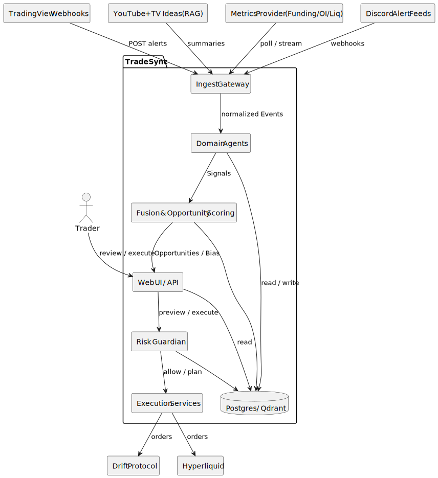
- 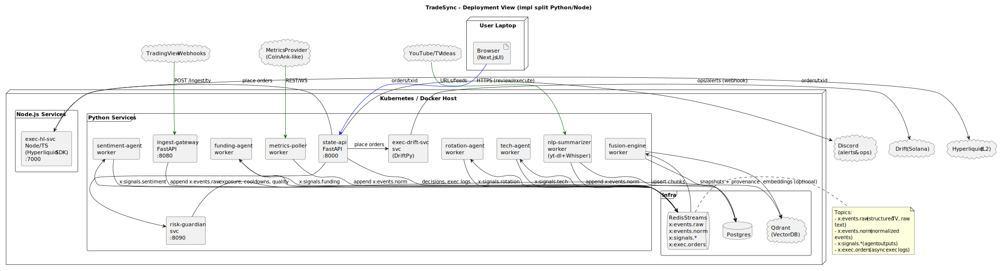

### 2) Core Structure
- 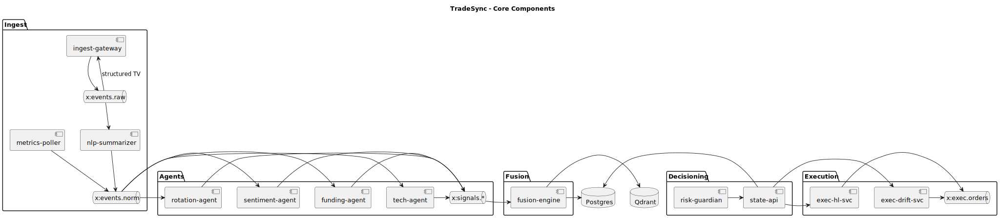
- 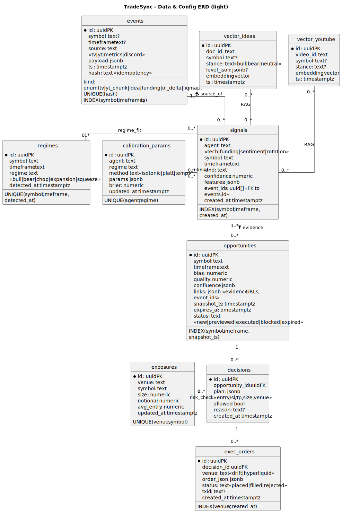

### 3) Event & Signal Flows
- 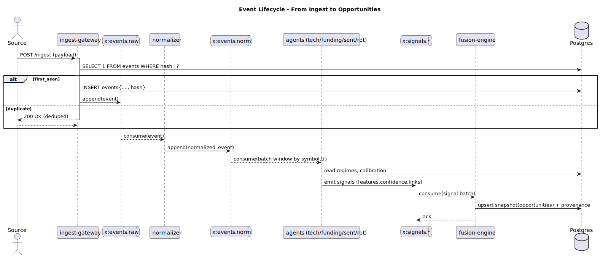
- 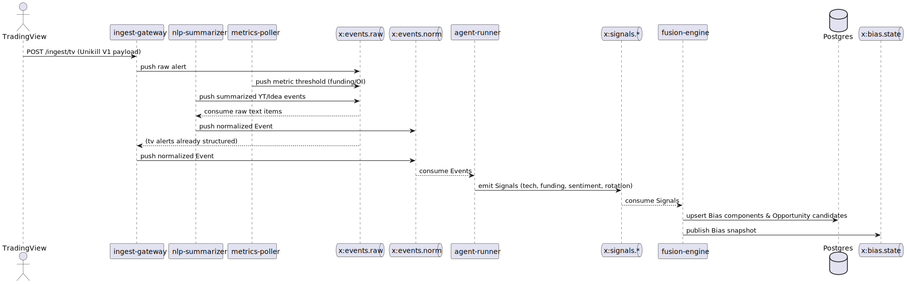
- 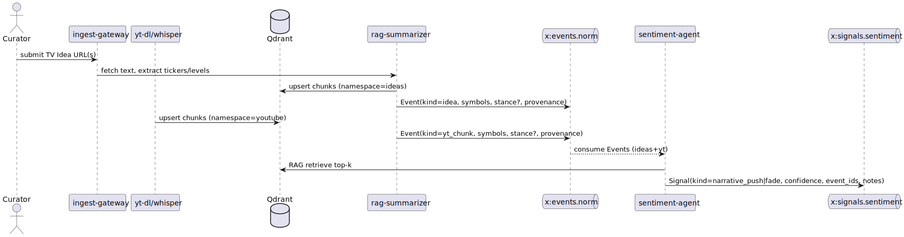
- 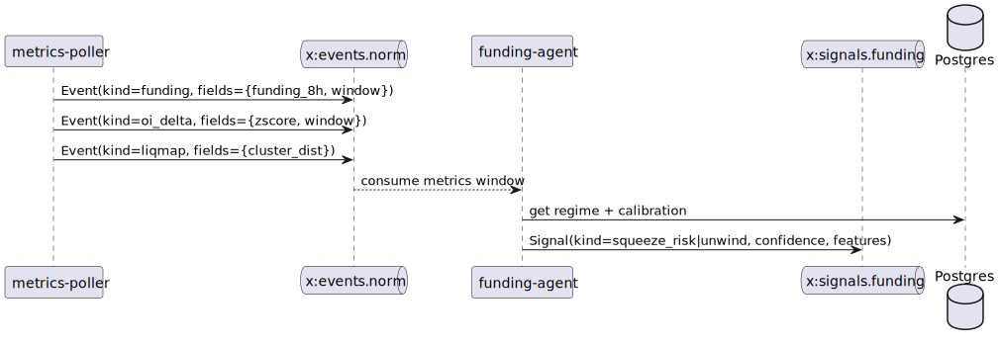
- 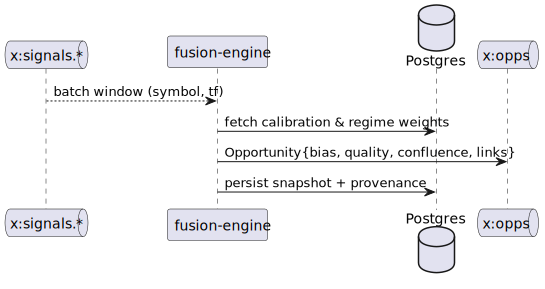

### 4) Risk & Execution
- 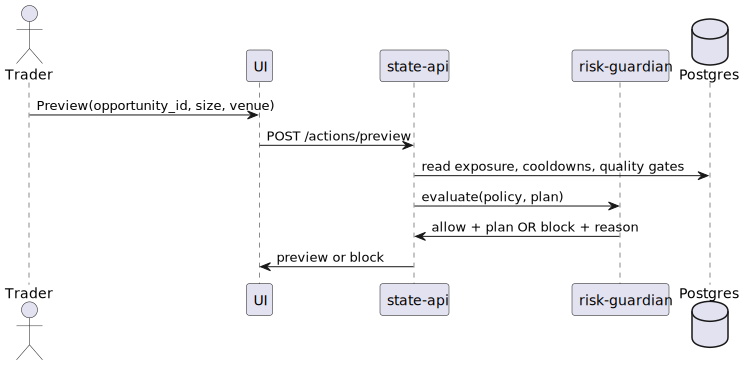
- 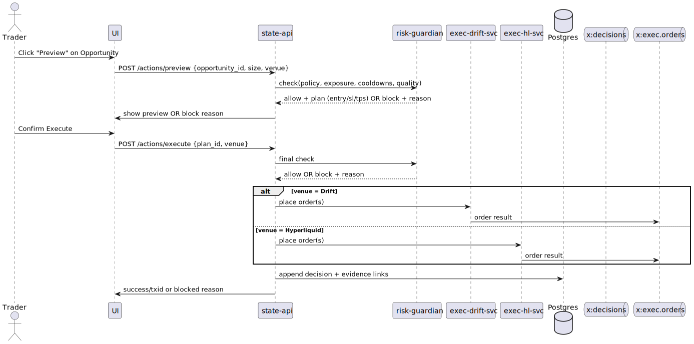

### 5) Calibration & State
- 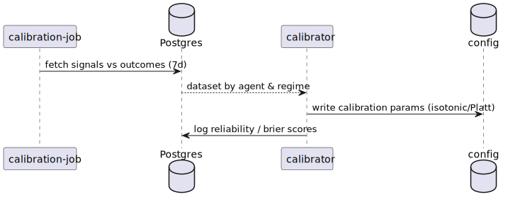
- 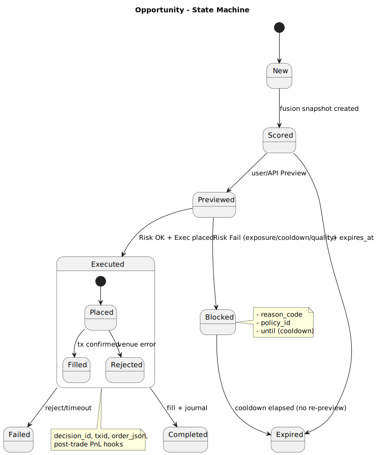
