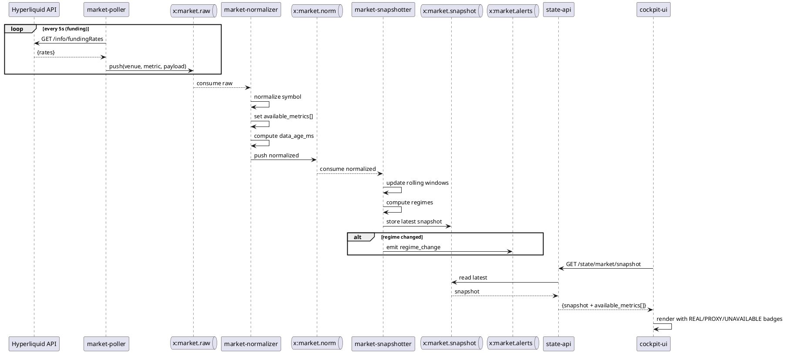

# Phase 3B — Market Data Expansion: Dataflow Architecture

> **Purpose**: Single source of truth for how market data flows through the system.
> **Invariant**: Prevents implementation drift across services.

---

## 1. High-Level Pipeline

```
┌─────────────────────────────────────────────────────────────────────────────────┐
│                           MARKET DATA EXPANSION PIPELINE                         │
└─────────────────────────────────────────────────────────────────────────────────┘

  [Hyperliquid API]      [Drift API]        [Future Providers]
         │                    │                     │
         ▼                    ▼                     ▼
    ┌─────────────────────────────────────────────────────┐
    │              MARKET-POLLER SERVICE                   │
    │  • Rate-limit aware (backoff + jitter)              │
    │  • Per-provider adapters                            │
    │  • Emits: venue, raw_payload, metric_type, ts       │
    └─────────────────────────────────────────────────────┘
                              │
                              ▼
                    ┌─────────────────┐
                    │  x:market.raw   │  (Redis Stream)
                    │  Raw payloads   │
                    └─────────────────┘
                              │
                              ▼
    ┌─────────────────────────────────────────────────────┐
    │              MARKET-NORMALIZER SERVICE               │
    │  • Symbol normalization (venue → canonical)         │
    │  • Sets: available_metrics[], source metadata       │
    │  • Flags: REAL / PROXY / UNAVAILABLE per metric     │
    │  • Computes: data_age_ms from raw ts                │
    └─────────────────────────────────────────────────────┘
                              │
                              ▼
                    ┌─────────────────┐
                    │  x:market.norm  │  (Redis Stream)
                    │  Normalized     │
                    └─────────────────┘
                              │
                              ▼
    ┌─────────────────────────────────────────────────────┐
    │              MARKET-SNAPSHOTTER SERVICE              │
    │  • Aggregates multi-horizon windows                 │
    │  • Computes regime classifications                  │
    │  • Stores latest snapshot per venue/symbol          │
    │  • Emits alerts on regime changes                   │
    └─────────────────────────────────────────────────────┘
                              │
              ┌───────────────┼───────────────┐
              ▼               ▼               ▼
    ┌─────────────────┐ ┌─────────────────┐ ┌─────────────────┐
    │x:market.snapshot│ │  x:market.alerts│ │  MarketStore    │
    │ (latest state)  │ │ (regime changes)│ │  (Redis/future) │
    └─────────────────┘ └─────────────────┘ └─────────────────┘
                              │
                              ▼
    ┌─────────────────────────────────────────────────────┐
    │                    STATE-API                         │
    │  GET /state/market/snapshot                         │
    │  GET /state/market/timeseries                       │
    │  GET /state/market/alerts                           │
    └─────────────────────────────────────────────────────┘
                              │
                              ▼
    ┌─────────────────────────────────────────────────────┐
    │                    COCKPIT-UI                        │
    │  • /market page (panels with truthful states)       │
    │  • Overview Market Thesis (real data)               │
    │  • Opportunity Detail context box                   │
    │  • /logs with Market Alerts feed                    │
    └─────────────────────────────────────────────────────┘
```

---

## 2. Where Key Operations Happen

### 2.1 Symbol Normalization

| Location | Operation |
|----------|-----------|
| `market-normalizer` | **Primary**: venue_symbol → canonical_symbol mapping |
| `docs/contracts/SYMBOL_NORMALIZATION.md` | Canonical symbol definitions |
| `services/ingest-gateway/app/normalize.py` | Shared normalization utilities |

**Canonical Format**: `{BASE}-PERP` (e.g., `BTC-PERP`, `ETH-PERP`, `SOL-PERP`)

**Venue Mappings**:
```
Hyperliquid: "BTC" → "BTC-PERP"
Drift:       "BTC-PERP" → "BTC-PERP" (already canonical)
```

### 2.2 Staleness Computation

| Location | Operation |
|----------|-----------|
| `market-poller` | Attaches `poll_ts` to each raw message |
| `market-normalizer` | Computes `data_age_ms = now() - raw.ts` |
| `market-snapshotter` | Updates `snapshot.ts`, preserves per-metric ages |
| `state-api` | Adds response-level `ts` and `data_age_ms` |
| `cockpit-ui` | Shows stale warning if `data_age_ms > threshold` |

**Staleness Thresholds** (configurable):
```yaml
orderbook:  5000ms   # 5 seconds
funding:    60000ms  # 1 minute
oi:         30000ms  # 30 seconds
volume:     30000ms  # 30 seconds
liquidations: 60000ms # 1 minute
```

### 2.3 available_metrics[] Assignment

| Location | Operation |
|----------|-----------|
| `market-normalizer` | **Sets initial flags** based on provider capabilities |
| `market-snapshotter` | **Updates flags** if data missing or stale |
| `state-api` | **Passes through** in all responses |
| `cockpit-ui` | **Renders** REAL / PROXY / UNAVAILABLE badges |

**Metric Status Enum**:
```python
class MetricStatus(str, Enum):
    REAL = "REAL"           # Direct from provider
    PROXY = "PROXY"         # Derived/estimated value
    UNAVAILABLE = "UNAVAILABLE"  # No data source
    STALE = "STALE"         # Data too old
```

---

## 3. Redis Stream Schemas

### 3.1 x:market.raw

```json
{
  "id": "1737475200000-0",
  "venue": "hyperliquid",
  "metric_type": "funding",
  "symbol_raw": "BTC",
  "payload": { /* raw API response */ },
  "poll_ts": 1737475200000
}
```

### 3.2 x:market.norm

```json
{
  "id": "1737475200100-0",
  "venue": "hyperliquid",
  "symbol": "BTC-PERP",
  "metric_type": "funding",
  "ts": 1737475200000,
  "data_age_ms": 100,
  "status": "REAL",
  "source": {
    "provider": "hyperliquid",
    "endpoint": "/info/fundingRates"
  },
  "value": {
    "rate": 0.0001,
    "next_funding_ts": 1737504000000
  }
}
```

### 3.3 x:market.snapshot

```json
{
  "venue": "hyperliquid",
  "symbol": "BTC-PERP",
  "ts": 1737475200000,
  "data_age_ms": 150,
  "available_metrics": [
    {"metric": "funding", "status": "REAL"},
    {"metric": "oi", "status": "REAL"},
    {"metric": "orderbook", "status": "REAL"},
    {"metric": "liquidations", "status": "PROXY"},
    {"metric": "volume", "status": "REAL"}
  ],
  "funding": {
    "horizons": {
      "now": 0.0001,
      "8h": 0.0003,
      "24h": 0.0008,
      "3d": 0.002,
      "7d": 0.005
    },
    "regime": "neutral"
  },
  "oi": {
    "horizons": {
      "5m": {"value": 500000000, "delta_pct": 0.5},
      "1h": {"value": 500000000, "delta_pct": 1.2},
      "4h": {"value": 498000000, "delta_pct": -0.4},
      "24h": {"value": 495000000, "delta_pct": 1.0}
    },
    "regime": "build"
  },
  "liquidations": {
    "horizons": {
      "5m": {"longs": 0, "shorts": 0},
      "1h": {"longs": 50000, "shorts": 20000},
      "4h": {"longs": 200000, "shorts": 100000},
      "24h": {"longs": 1000000, "shorts": 500000}
    },
    "source_note": "PROXY: estimated from OI deltas"
  },
  "volume": {
    "horizons": {
      "5m": 5000000,
      "15m": 15000000,
      "1h": 50000000,
      "4h": 180000000,
      "24h": 800000000
    },
    "cvd": {
      "5m": 100000,
      "1h": -500000,
      "24h": 2000000
    },
    "regime": "high"
  },
  "orderbook": {
    "spread_bps": 1.5,
    "depth": {
      "bid_1pct": 5000000,
      "ask_1pct": 4800000
    }
  },
  "regimes": {
    "funding": "neutral",
    "oi": "build",
    "volume": "high",
    "trend": "range"
  }
}
```

### 3.4 x:market.alerts

```json
{
  "id": "1737475200200-0",
  "venue": "hyperliquid",
  "symbol": "BTC-PERP",
  "ts": 1737475200000,
  "alert_type": "regime_change",
  "metric": "funding",
  "previous_regime": "neutral",
  "new_regime": "extreme_positive",
  "context": {
    "current_rate": 0.05,
    "threshold": 0.01,
    "message": "Funding flipped to extreme positive (5% annualized)"
  }
}
```

---

## 4. Service Responsibilities

### 4.1 market-poller (new service or extend ingest-gateway)

**Responsibilities**:
- Poll provider APIs at configured intervals
- Respect rate limits with exponential backoff + jitter
- Emit raw payloads to `x:market.raw`
- Track last successful poll per (venue, metric)

**Rate Limit Strategy**:
```python
class RateLimiter:
    def __init__(self, requests_per_minute: int):
        self.rpm = requests_per_minute
        self.min_interval = 60 / requests_per_minute
        self.last_request = 0
        self.backoff_multiplier = 1.0

    async def wait(self):
        elapsed = time.time() - self.last_request
        wait_time = (self.min_interval * self.backoff_multiplier) - elapsed
        if wait_time > 0:
            await asyncio.sleep(wait_time + random.uniform(0, 0.5))  # jitter
        self.last_request = time.time()

    def on_success(self):
        self.backoff_multiplier = max(1.0, self.backoff_multiplier * 0.9)

    def on_rate_limit(self):
        self.backoff_multiplier = min(10.0, self.backoff_multiplier * 2.0)
```

### 4.2 market-normalizer

**Responsibilities**:
- Consume `x:market.raw`
- Apply symbol normalization
- Set `available_metrics[]` with status flags
- Compute `data_age_ms`
- Emit to `x:market.norm`

### 4.3 market-snapshotter

**Responsibilities**:
- Consume `x:market.norm`
- Maintain rolling windows for each horizon
- Compute regime classifications
- Store latest snapshot in `x:market.snapshot` (or MarketStore)
- Emit regime change alerts to `x:market.alerts`

### 4.4 state-api (extended)

**New Endpoints**:
```
GET /state/market/snapshot?venue=hyperliquid&symbol=BTC-PERP
GET /state/market/timeseries?venue=hyperliquid&symbol=BTC-PERP&metric=funding&window=24h
GET /state/market/alerts?venue=hyperliquid&limit=50
```

---

## 5. Multi-Horizon Windows

### 5.1 General Metrics (OI, Volume, Spread)

| Horizon | Retention | Use Case |
|---------|-----------|----------|
| 5m | 1 hour | Immediate context |
| 15m | 4 hours | Short-term regime |
| 1h | 24 hours | Intraday context |
| 4h | 7 days | Swing context |
| 24h | 30 days | Daily regime |
| 7d | 90 days | Macro context |

### 5.2 Funding Rate Windows

| Window | Description |
|--------|-------------|
| now | Current/next funding rate |
| 8h | Last 8-hour average (1 funding period) |
| 24h | Last 24-hour average (3 funding periods) |
| 3d | 3-day average |
| 7d | 7-day average |

### 5.3 Liquidation Windows

| Window | Description |
|--------|-------------|
| 5m | Immediate liquidation activity |
| 1h | Hourly aggregate |
| 4h | 4-hour aggregate |
| 24h | Daily aggregate |
| 7d | Weekly aggregate (optional) |

---

## 6. Regime Classification Logic

### 6.1 Funding Regime

```python
def classify_funding_regime(rate_24h: float) -> str:
    """
    Annualized rate = rate_24h * 365
    """
    annualized = rate_24h * 365

    if annualized > 0.50:      # >50% APR
        return "extreme_positive"
    elif annualized > 0.20:    # >20% APR
        return "elevated_positive"
    elif annualized < -0.50:
        return "extreme_negative"
    elif annualized < -0.20:
        return "elevated_negative"
    else:
        return "neutral"
```

### 6.2 OI Regime

```python
def classify_oi_regime(delta_24h_pct: float, delta_4h_pct: float) -> str:
    """
    Build: OI increasing with momentum
    Unwind: OI decreasing with momentum
    Flat: Consolidation
    """
    if delta_24h_pct > 3.0 and delta_4h_pct > 0:
        return "build"
    elif delta_24h_pct < -3.0 and delta_4h_pct < 0:
        return "unwind"
    else:
        return "flat"
```

### 6.3 Volume Regime

```python
def classify_volume_regime(vol_24h: float, avg_vol_7d: float) -> str:
    """
    Compare current volume to 7-day average
    """
    ratio = vol_24h / avg_vol_7d if avg_vol_7d > 0 else 1.0

    if ratio > 2.0:
        return "high"
    elif ratio < 0.5:
        return "low"
    else:
        return "normal"
```

---

## 7. Error Handling & Degradation

### 7.1 Provider Failure

When a provider fails:
1. Poller logs error, applies backoff
2. Normalizer marks affected metrics as `STALE` after threshold
3. Snapshotter preserves last known values with increased `data_age_ms`
4. UI shows stale warning with last update time

### 7.2 Missing Metrics

When a metric is not available from provider:
1. Normalizer marks metric as `UNAVAILABLE` or `PROXY`
2. Snapshotter includes null values with explanation
3. Regime engine skips unavailable metrics (doesn't guess)
4. UI shows "Unavailable" or "Proxy" badge with tooltip

---

## 8. PlantUML Sequence (for reference)



---

## 9. Configuration

### 9.1 Environment Variables

```bash
# Market Poller
MARKET_POLL_INTERVAL_FUNDING=5000      # ms
MARKET_POLL_INTERVAL_OI=5000           # ms
MARKET_POLL_INTERVAL_ORDERBOOK=2000    # ms
MARKET_POLL_INTERVAL_VOLUME=10000      # ms

# Rate Limits
HL_RATE_LIMIT_RPM=120                  # requests per minute
DRIFT_RATE_LIMIT_RPM=60

# Staleness Thresholds
STALE_THRESHOLD_ORDERBOOK=5000         # ms
STALE_THRESHOLD_FUNDING=60000          # ms
STALE_THRESHOLD_OI=30000               # ms

# Feature Flags
MARKET_STORE_BACKEND=redis             # redis | postgres
ENABLE_TIMESCALE=false
```

### 9.2 Supported Symbols (V1)

```yaml
symbols:
  - BTC-PERP
  - ETH-PERP
  - SOL-PERP
  # Add more as needed
```

---

## 10. Files Created/Modified

| File | Purpose |
|------|---------|
| `docs/architecture/phase3B_dataflow.md` | This document |
| `docs/providers/MARKET_PROVIDER_MATRIX.md` | Provider capabilities |
| `docs/contracts/MARKET_CONTRACT.md` | MarketSnapshot schema |
| `docs/contracts/SYMBOL_NORMALIZATION.md` | Symbol mapping rules |
| `services/market-poller/` | New service (or extend ingest-gateway) |
| `services/market-normalizer/` | New service |
| `services/market-snapshotter/` | New service |
| `services/state-api/app/routes/market.py` | New endpoints |
| `services/cockpit-ui/src/pages/Market.tsx` | Wired panels |

---

*Last updated: 2026-01-21*
*Phase: 3B — Market Data Expansion*
